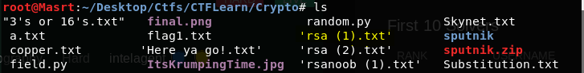
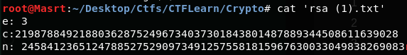
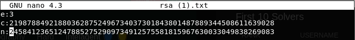
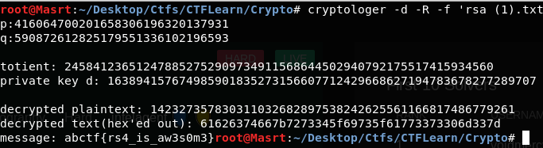

# RSA Beginner

### Points:90	

### Description:
I found this scribbled on a piece of paper. Can you make sense of it? [link](https://mega.nz/#!zD4wDYiC!iLB3pMJElgWZy6Bv97FF8SJz1KEk9lWsgBSw62mtxQg)

## Solution:

Well, we have this file: *rsa(1).txt*, from the link.



While the description doesn't hint us much. The filename clearly suggests that its a RSA algorithm decryption challenge. And so does its contents...



If you like maths and its your first time solving RSA, trust me this [wikipedia](https://en.wikipedia.org/wiki/RSA_(cryptosystem)) will have you in tour, scratching the basics for some good weeks. OR you can simply use this tool I made [D3cryptor](https://github.com/Masrt200/WoC2k19).

Once you have gone through the installation, you know that we need to adjust the file format for my tool to accept inputs. Using *nano* here,



Now simply giving the file to my tool D3crypt0r for decrypting this RSA;
```bash
cryptologer -d -R -f 'rsa (1).txt'
```



Well there you have it the flag is *abctf{rs4_is_aw3s0m3}* Cheers!


# Q's Cubes

### Points:160

### Descripion:
For Christmas, Q received an enormous set of cubes with letters and numbers on them. He decided that rearranging these cubes in a certain way would let him hide a secret message. The way he rearranges them is by folding all of them in half, over and over, until they form a single pillar. This is explained in more detail here: - [example](https://mega.nz/#!raBixa7b!HkrNMoGU3kutVtGmrS81y-7Yx4VSO1JorlUICD4XOIM) - Q leaves us this aerial view (your input) of his cubes here: [problem](https://mega.nz/#!KOJyFKKL!2dNvk97L09sUwfM4DVtZ_logrtvlYzWwZvtur6C-_DU) :: What message was Q trying to convey?

## Solution:

Was this the only problem with a 5.0 community rating, hmmm? Well this Q guy provides us with a folding algorithm to enwrap his messages. Taking the basic example, we are required to fold his initial cube of text firstly from top to bottom and then from left to right...  and then repeat the entire process until we reach a single block of text. Reversing said block is our message.


I wrote this python scipt to solve the problem...

```python
import binascii

f=open('q2.txt','r')
line=f.readline()

a=[]
while line:
	a.append(list(line)[:-1])
	line=f.readline()

for i in a:
	print(i)

while len(a)>1:

	b=[]
	i=0
	while i<len(a)/2:
		n=[]
		j=0
		while j<len(a):
			n.append(a[len(a)-1-i][j]+a[i][j][::-1])
			j+=1
		b.append(n)
		i+=1

	b=b[::-1]

	for i in b:
		print(i)

	a=[]
	i=0
	while i<len(b):
		j=0
		n=[]
		while j<len(b):
			n.append(b[i][len(b)*2-1-j]+b[i][j][::-1])
			j+=1
		a.append(n[::-1])
		i+=1


	for i in a:
		print(i)

print('Final Message:',a[0][0][::-1])

print(binascii.unhexlify(a[0][0][::-1]))
```

Running it, you will notice that the final message is a hex-string, using binascii we get the result;


*cubigami* is the flag.


# Dawn's Lawn

### Points:60

### Description:
Dawn has a magical lawnmower that she uses to mow her square lawn. As soon as she trims the grass, it starts growing quickly. Once the grass grows tall enough, it turns into a flower. Dawn has a lawn that has flowers, grass, and dirt. More details can be found here: [examples](https://mega.nz/#!bTwAgS5K!_7Ct7i5rPzsTwxB-QXuM0C751gYppdItpfGl3Cr-RaY) - You can find Dawn's actual lawn (your input) here: [problem](https://mega.nz/#!OGxQDQgA!pQdDXyto9sqdoprz53541HTyPMr9aLFBKP29Rutqom8) How many flowers are in Dawn's lawn after she mows it completely?

##Solution:

What more can you say about a challenge that requires programming? Logic maybe?!
If you are stuck on scripting the problem, here it is for you. *Note: The third example given with the 15x15 lawn is probably incorrect. The correct answer is 70 flowers*

```python
f=open('dawn2.txt','r')
line=f.readline()
lawn=[]
lines=0

'''
rules
* : a flower
| : grass 4
/ : grass 3
- : grass 2
# : grass 1
_ : fertile dirt
. : infertile dirt
'''

order=['*','|','/','-','#','_','.']
while line:
	if '\n' in line:
		line=line[:-1]

	line=line.replace("\\",'#')
	lines+=1
	lawn.append(list(line))
	line=f.readline()

for i in lawn:
	print(i)

def grow(cn,p):
	loop_count=(cn-1)//lines
	z=0
	x=p
	while loop_count>0:
		if lawn[x][z]=='.':
			lawn[x][z]='.'
		else:
			if order.index(lawn[x][z])>0:
				lawn[x][z]=order[order.index(lawn[x][z])-1]
			else:
				lawn[x][z]=order[0]

		x=lines-1-p
		p=lines-1-p
		loop_count=loop_count-1
		z+=1

j=0
i=0
cn=0
while j<lines:
	if i==0:
		while i<lines:
			try:
				lawn[i][j]=order[order.index(lawn[i][j])+2]
			except:
				lawn[i][j]=order[6]
			cn+=1
			grow(cn,i)
			i+=1
	elif i==lines:
		while i>0:
			i-=1
			try:
				lawn[i][j]=order[order.index(lawn[i][j])+2]
			except:
				lawn[i][j]=order[6]
			cn+=1
			grow(cn,lines-1-i)
	j+=1

print('\n\n')
flowers=0
for k in lawn:
	for j in k:
		if j=='*':
			flowers+=1
	print(k)

print('Flowers',flowers)
```

*I used '#' instead of '/' for better clarity...* Running it we will get **194** as the solution.
